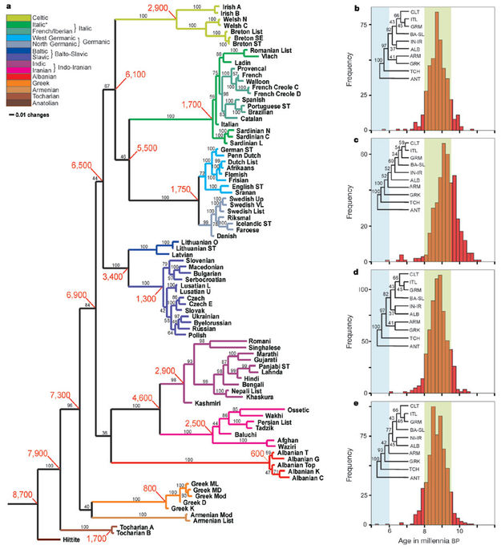

<!-- $theme: default -->

# Foundations of the Age-Area Hypothesis
### Matt Baker

---

# Background
- Research agenda: the economic basis for indigenous institutions and cultural practices.
- Big question: How environment, technology, and institutions co-evolve. 

---

# Recently
- Applications in economic growth
- Computational linguistics
- Incorporation of geographical data.

### Question: How did ethnic and geographic diversity that we observe today come about?

---
# Cultural similarities
- Closely related to genetic similarities
- Computational linguistics - treat aspects of language like a genetic code with drift.
- Phylogenetic analysis of related cultures; epitomized by Mace (2006).
- Atkinson and Gray (2006) example: Indo-European Tree.
- Fairly sophisticated machinery for doing this!

---

---
## Questions: 
- Where did this tree originate? 
- How did the peoples of the tree come to be where they are?
- Which related cultures have been in close proximity, and for how long?

### Questions of geography, cultural/lingustic drift, and time.

---
# The Age-Area Hypothesis (AAH)
- Sapir (1916) - the root of the tree is the geographical point of origin.
- Recursive application - migratory routes and maybe even times.
- Used to resolve historical debates, but also could be important in creating new theories

---
# Old applications and continuing debates
- Origins of Athabaskan/Na-Dene speakers
- Indo-European origins
- Afro-Asiatic origins
- Spread of Bantu peoples
- Native American population dispersal
---

# On the need or theory...
Greenhill and Gray (2005) write: "many expansion scenarios are little more than plausible narratives. A common feature of these narratives is the assertion that a particular line of evidence (archaeological, linguistic, or genetic) is 'consistent with' the scenario. 'Consistent with' covers a multitude of sins. 

---
# So why believe the AAH (or not)?
- ### Occam's Razor?
- ### Minimum effort or \# of moves?
- ### Dyer (1956, p. 613) hits upon the idea of conserving moves: "...the probabilities of different reconstructed migrations are in inverse relation to the number of language movements required."

---
# Problem Preview
## A Phylogenetic Tree

---
# Problem Preview

---
# Candidate Migratory Histories:
- A is point of origin - A to B to C to D to E
- C is point of origin - C to A, C to B, C to D to E
- Both are consistent with observe drift. Latter seems more complex. Howso? 
- Note "minimum moves" doesn't get us very far. Both have four moves!
---

# Basic Model:
- ## Assume a full, rooted binary tree
   - Tree with $z$ terminal nodes will have $z-1$ internal nodes, which are the minimal number of moves needed to span the tree.
- ## Current locations coincide with historic locations
- ## All constituents of the tree observed	
---
# Definitions
## Migratory Event
A location jump from one location to a new, unoccupied one
## Migratory Chain
A sequence of "forward moving" migratory events that end at a terminal node/taxa/culture.
## Migratory History
A collection of Chains spanning the whole tree, with a "deepest chain" starting at a given location. 

---
# Assumptions
1. Each migratory chain occupies a single location at any given time.
2. When a chain moves from its current location, a new chain starts in its place at the location.
3. Migratory chains jump to new locations according to an exponential density.
4. Chains are distinct; each has its own arrival rate parameter.

---
# Consider the first history
- Requires a chain from A to B to C to D (or E) to E (or D)
- Given assumptions, a likelihood can be written:

$$
L_A = \frac{(\lambda_1 T)^4e^{-\lambda_1T}}{4!}\frac{(\lambda_2 t_6)^0e^{-\lambda_2t_6}}{0!}\frac{(\lambda_3 t_7)^0e^{-\lambda_3t_7}}{0!}\frac{(\lambda_4 t_8)^0e^{-4t_8}}{0!}
$$

---
# Maximization of the likelihood:
Most of the parameters are degenerate, but one is not...
That is: $\lambda_2=\lambda_3=\lambda_4=0$, but $\lambda_1^*=\frac{4}{T}$. Subsitution gives:

$$
L_A=\frac{4^4e^{-4}}{4!}
$$

---
## What about C?

Requires:
- A migration from C to A
- Another one from C to B
- A final chain starting from C going from D (or E) to E (or D).
The likelihood of all of this, applying the same principles:

$$
L_{C}=\frac{(\lambda_1t)^1e^{-\lambda_1t}}{1!}\frac{(\lambda_2(t-t_0))^1e^{-1}}{1!}
\frac{(\lambda_3(t-t_0-t_1))^2e^{-\lambda_3(t-t_0-t_1)}}{2!}
$$

---

# Concentrated likelihood:
$$
L_{C}=\frac{1^1e^{-}}{1!}\frac{1^{1}e^{-1}}{1!}\frac{2^2e^{-2}}{2!}=
\frac{2^2e^{-4}}{2!}
$$

## What about A versus C? 
$$
L_A/(L_A+L_C)=\frac{\frac{4^4}{4!}}{\frac{4^4}{4!}+\frac{2^2}{2!}}=.84
$$

---
# Key feature is Kernel function:

$$
h(n)=\frac{n^n}{n!}
$$

- ## Convex in $n$, due to structure of Poisson/Exponential distribution.

---
# Observations:
- With each location $k$, there are a family of possible migratory histories $\mathcal{H}_k$.
- For $H_k \in \mathcal{H_k}$, define $N(H_k)$ as a count of the migratory chains in the history.   
- Define $n(C)$ as a count of the number of events in a migratory chain, and then define:
- $n_{H_k}^*=\max_{C_{ik}\in H_k} [n(C_{1k}),n(C_{2k}),...,n(C_{N(H_k)k})]$ The maximum node count for a chain in $H_k$. 

---
# Definition: Dyen Divergence
Start with a function $D_{H_{k}}=m(n^*_{H_k},N(H_k))$, where $m$ is increasing in its first argument, and decreasing in the second. Define now the _Dyen Divergence_ as
$$
D_k=\max [D_{H_{1k}},D_{H_{2k}},..., D_{H_{Ik}} ]
$$
A family of divergence measures. Examples: 
- $D^1_k=n^*_{H_k}-N(H_k)$
- $D^2_k=\frac{n^*_{H_k}}{N(H_k)}$

---

# Age-Area Theorem

Suppose that Assumptions 1 hold, and define a Dyen Divergence measure as in definition 1. Then  
$$
D_k \geq D_j \Longrightarrow L_k\geq L_j
$$
and in particular
$$
D_k=\max [D_1,D_2,D_3,...,D_n ] 
$$
implies
$$
L_k=\max\left[L_1,L_2,L_3,...,L_n\right]
$$
--- 

# If branches are known, not much changes.

---
## Dyen Divergence Functions
$$
D^1_i=\frac{n^*_{H^*_k}}{N(H^*_k)}
$$
and:

$$
D^2_i=n^*_{H^*_k}-N(H^*_k)
$$
---
# Additional example - C v. E...

---

---
# Distributions over Histories
- [Simulation](https://s3.amazonaws.com/instevo/CombNaDeneMovie.html)
---

HOw about this brah?

